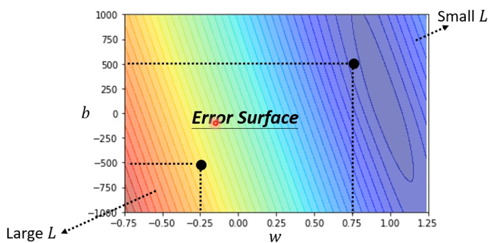
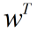
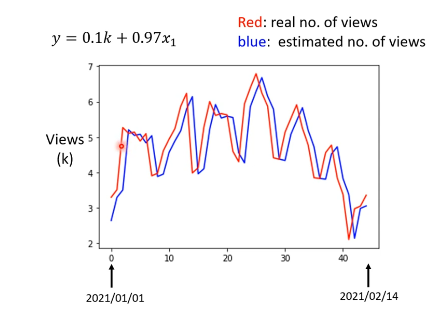

# 机器学习

## 机器学习简介

### 机器学习概念

机器学习就是让机器找函数——Machine Learning ≈ Looking for Function

可以让机器识别语言并输出运营里的文字，这样机器就会将输入的语音放入一个函数中，输出为语音里的文字

而这个函数靠人工是无法写出，故要用机器来找相应函数

当然还有图片识别，和下棋的alpha-go怎么下棋同样如此

### 机器学习的类别

- 函数不同机器学习就有不同类别分为回归、分类和其他

1. Regression(回归)： 回归即输入任意类型数据放入函数，运行后其的输出是一个scalar(标量，即一个数值)，而找出这个函数的任务就叫 regression

   例如要预测明天的PM2.5数值，输入时今天PM2.5的值、温度、臭氧浓度等作为函数输入，经过函数运算而输出一个数值就是明天PM2.5的浓度。

2. Classification(分类)：即输入一些数据，人为的给出一些选项，函数运行后会判断并选择正确的一项作为输出，找这个函数的任务就叫Classification

   例如找出垃圾邮件，输入一个邮件，选项时该邮件是或不是垃圾邮件，然后经过函数判断，输出该文件是或不是垃圾文件

   

   还有alpha-go下棋，找下一步棋正确的位置

   

3. Structured Learning：是机器学习的一个衍生，使得机器可以根据描述来画一个图，写一份演讲稿等，就像现在AI画图写论文

### 如何找函数

分三步

例子：根据今天自己频道的点击量来预测自己频道明天的点击量

#### 1.先自己假设一个函数(人来做)

自己预估的函数叫Model(模型)，此处我们预估的模型叫叫做liner model(线性模型，就是一次函数)，y是预测的点击量，代表的是今天的点击量，x、y叫做feature(特征)，w和b是未知参数，通过已有知识和所给数据来猜测，是不知道的，w叫weight(权值)，b叫bias(数学里面叫做增量、偏量，英文翻成叫偏见)

注意：函数表达式和w、b，是要通过自己的对该领域的知识来猜测的，也就是我们自己要先对自己做到问题有一定了解，然后再进行猜测，也就是上面图片中的domain knowledge(领域知识)

#### 2.根据训练数据定义Loss(机器来做)

Loss也是一个函数，其输入是模型里的未知参数，记作 L(b, w)，Loss函数会根据输入的未知参数是否适合该模型，输出值就是未知参数好或不好

eg：这里k是代表1000，别弄错

判断适不适合就要根据训练数据了，训练数据是之前的播放量

这里给出了2019-2020年的部分播放量

根据2017/01/01预测01/02，y = 5.3k，发现估算的值和真实4.9k差很多

然后可以估算之后每个日期播放量，以及算出估算值与真实值的误差差值记作

然后求出所有差值的平均值 L，也就是Loss函数的输出，L越大说明猜测的未知参数不好，L越小说明猜测的未知参数很好

注意，有时会取不一样的差值，之前用的是绝对差值，还有的会用平方差值，L的叫法也会随之改变，L越大未知参数猜测的越不好是一样的

穷举出所有的b和w值可以画出下面的等高线图，越偏红的位置L越大越不好，越紫的位置L越小越好，这里是老师给的图。这个等高线图叫error Surface

等高线图在基本上L的值稳定时，可以看到在紫色区域看到有个椭圆区域，说明这个区域的参数取值拿来估测是比较好的，因为这一区域是等高的，就像山的海拔图一样上面是个小圆，越往下越大，而取其中一小部分来看，大圈的等高线基本上就是直线因为范围大，而上面的任然是个圆

例如：全貌是这样的

取一小部分，发现大区域只剩下直线了

#### 3.Optimization最佳化(机器来做)

求出最优的未知参数，使L最小的w和b

注意：arg min 就是使后面这个式子达到最小值时的变量w,b的取值，arg是argument，average才是平均值

我们这里使用求最优的方法叫Gradient Descent(梯度下降法)

先只看一个参数

- 随机取一个点初始点，从该点在图像的位置中做切线

计算该点处微分，即斜率，若斜率为负(Negative)切线左高右低，取右边的大于的值，若为斜率正(positive)左低右高，则取左面的小于值，因为我们要小的L值时的w的值就要往图像低的一端取。

- 往左或右增加或减少多少取决于两部分①学习速率(learning rate)记作，大小由人自己决定，人自己决定的东西叫做**超参数(hyperparameters)**，越大学习的快增减的也越多，越小学习的越慢，增减的越小，②斜率即算的微分

  往左或往右增减的长度为

一直移动后到停下，得到

停下条件：①自己设定移动次数，移动多少次停下  ②微分值为0时或叫斜率为0时

但发现后面还有全局的最小值所以前面停下来的w值还不是正确的使L最小的值，这也是Gradient Descent(梯度下降法)的缺德

明白了一个参数求最优

现在w和b，同时求最优

在等高线图的w，b优化的移动方向

最优的w是0.97，最优的b是0.1k，这里误差L为0.42k

#### 4.结果

所以最中得到的预测函数为

x轴是日期，y轴是观看人数，红线是当天实际观看人数，红线是用当天观看人数带入函数预测明天的观看人数。

可以看到该预测基本上当天的观看人数和预测的明天观看人数基本相同，即拿今天观看人数就当作明天可能观看的人数，所以可能这个预测模型可能不太好，这时就要根据你所学的知识再增加几天作为输入，或者选取另一个模型。

